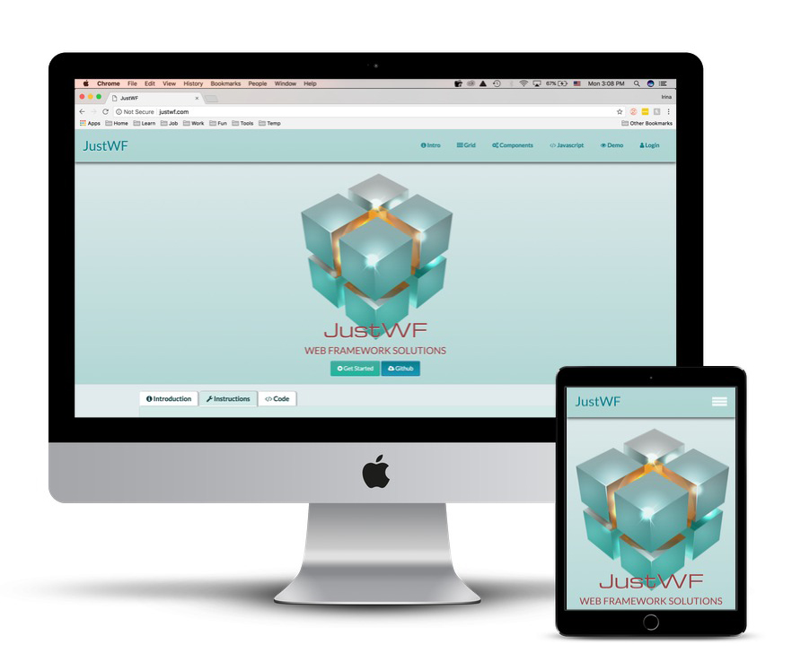

# JustWF
> JustWF is a set of HTML5, CSS, and jQuery (javascript) files, layouts, and elements designed to help developers to gain the upper hand in the web projects

#### This project is published at: [JustWF](https://irinaserova.github.io/JustWF/)

The goal of the project is to provide a basic set of components and helper methods that developers can use to build sites that are fast and user-friendly. JustWF is a modern framework and has a lot of  advantages. It  differences itself from other CSS/JS frameworks by focusing on the following features:
- small and fast;
- easy to learn, and easy to use;
- uses standard CSS3 and HTML5, jQuery and JavaScript library;
- speeds up and simplifies web development;
- supports modern responsive design (mobile first) by default;
- provides CSS equality for all browsers. Chrome, Firefox, IE, Safari, and more;
- provides CSS equality for all devices. PC, laptop, tablet, and mobile;
- small payload size
-  it is free to use. No license is necessary.

Our Web framework can make your life easier and can make some of the decisions for you.  

